# pre_order_flutter_app

[](https://codemagic.io/apps/6098b499f3dcf2b4763b420c/6098b499f3dcf2b4763b420b/latest_build)

## Architecture



## CI/CD


## Getting Started

This project is a starting point for a Flutter application.

A few resources to get you started if this is your first Flutter project:

- [Lab: Write your first Flutter app](https://flutter.dev/docs/get-started/codelab)
- [Cookbook: Useful Flutter samples](https://flutter.dev/docs/cookbook)

For help getting started with Flutter, view our
[online documentation](https://flutter.dev/docs), which offers tutorials,
samples, guidance on mobile development, and a full API reference.

### Build to Firebase App Distribution

#### Android:

```shell
$ cd android
$ fastlane distribute
```

#### iOS:

```shell
$ cd ios
$ fastlane distribute
```

### build to TestFlight

#### iOS:

```shell
$ cd ios
$ fastlane beta
```


### Enabling debug mode Local (Firebase Analitycis)

#### Android:

To enable Analytics Debug mode on an Android device, execute the following commands:

```shell
$ adb shell setprop debug.firebase.analytics.app ise.sr.u2021.pre_order_flutter_app
```

This behavior persists until you explicitly disable Debug mode by executing the following command:

```shell
$ adb shell setprop debug.firebase.analytics.app .none.
```

#### iOS:

Settings: Xcode > Product > Scheme > Edit Scheme > Run > Aguments

**Run Build in Xcode!!**

To enable Analytics Debug mode on your development device, specify the following command line argument in Xcode :

```
-FIRDebugEnabled
```

This behavior persists until you explicitly disable Debug mode by specifying the following command line argument :

```
-FIRDebugDisabled
```
